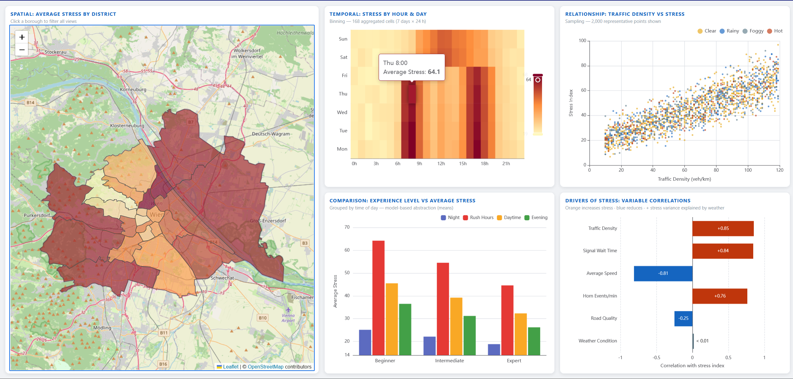

# Traffic Stress Dashboard - Vienna

An interactive data visualization dashboard exploring the factors that influence driver stress in an urban setting. Built for the **Data Visualisation, Presentation and Real-time Integration of Digital Products** course at IMC Krems.

**Live demo:** [https://traffic-dashboard-data-vis.netlify.app](https://traffic-dashboard-data-vis.netlify.app)



---

## Research Question

> How do traffic conditions, environmental factors, driver experience, and temporal/spatial context collectively influence driver stress in an urban setting?

---

## Dataset

The underlying data is the [Smart City Traffic Stress Index Dataset](https://www.kaggle.com/datasets/sonalshinde123/smart-city-traffic-stress-index-dataset) from Kaggle - 50,000 records with the following columns:

| Column | Description |
|--------|-------------|
| `traffic_density` | Vehicles per km (10–119) |
| `horn_events_per_min` | Horn honking frequency (0–24.9) |
| `avg_speed` | Average speed in km/h (13.9–90) |
| `signal_wait_time` | Traffic signal wait time in seconds (5–74.5) |
| `weather_condition` | Categorical: Clear, Rainy, Foggy, Hot |
| `road_quality_score` | Road quality on a 1–10 scale |
| `driver_experience_level` | Categorical: Beginner, Intermediate, Expert |
| `stress_index` | Normalized driver stress score 0–100 (target variable) |

### Synthetic Dimensions

Two additional dimensions are assigned to the dataset records at load time to enable spatial and temporal analysis:

**Vienna Districts** - each record is assigned to one of Vienna's 23 official districts proportionally by population share. The district boundaries and GeoJSON geometries were sourced from the [click_that_hood](https://github.com/codeforgermany/click_that_hood/tree/main/public/data) repository by Code for Germany.

**Temporal Data** - hour of day and day of week are synthetically generated and assigned to records to reflect realistic urban traffic patterns. Records with the highest traffic density are paired with rush-hour time slots (07:00–09:00 and 16:00–18:00 on weekdays), producing the characteristic twin stress peaks visible in the heatmap. Weekends follow a single midday plateau with no rush peaks. This generation logic was designed to be as realistic as possible rather than uniform or random.

---

## Charts

The dashboard consists of five coordinated views. Clicking any district on the map filters all other charts to that district's data - this is a genuine brushing+linking interaction, not a dropdown filter.

### 1. Spatial: Average Stress by District
A choropleth map of Vienna's 23 districts rendered with Leaflet.js on OpenStreetMap tiles. Each district is filled with a sequential color scale (pale yellow → orange → dark red) representing its average stress index. Districts with higher average stress appear darker. Click a district to filter all other charts.

### 2. Temporal: Stress by Hour & Day
A heatmap with hours of the day on the x-axis and days of the week on the y-axis. Each cell shows the average stress for that hour/day combination, aggregated across all 50,000 records (168 cells total). Rush-hour peaks on weekday mornings and evenings are clearly visible. This follows the **binning** scalability strategy - pre-aggregating 50k points into a compact grid.

### 3. Relationship: Traffic Density vs Stress
A scatter plot of traffic density (x-axis) against stress index (y-axis), with each point colored by weather condition. 2,000 representative points are shown using **sampling** to avoid overplotting at full scale. A positive relationship between density and stress is visible across all weather conditions.

### 4. Comparison: Experience Level vs Average Stress
A grouped bar chart showing average stress per driver experience level (Beginner, Intermediate, Expert), broken down by time of day (Night, Rush Hours, Daytime, Evening). This reveals whether experience reduces stress uniformly or specifically during high-pressure periods such as rush hours. When a district is selected via brushing, the chart updates to reflect that district's data only.

### 5. Drivers of Stress: Variable Correlations
A horizontal bar chart showing how strongly each numeric variable correlates with the stress index (Pearson correlation coefficient). Bars pointing right (burnt orange) indicate variables that increase stress; bars pointing left (deep blue) indicate variables that reduce stress. Weather condition is included as a separate grey bar using eta squared (η²), a measure of how much stress variance weather explains. This chart brings together variables not visible elsewhere in the dashboard - signal wait time, horn events, average speed, and road quality - into a single ranked view.

---

## Color Design

Colors follow the perception and color guidelines covered in the course:

- **Sequential colormap** (YlOrRd from ColorBrewer) for the choropleth and heatmap - appropriate for quantitative, ordered data
- **Categorical palette** for weather conditions, semantically coded: amber = Clear, deep blue = Rainy, blue-grey = Foggy, burnt orange = Hot
- **Diverging palette** for the correlation chart - burnt orange for positive correlations, deep blue for negative

---

## Local Setup

```bash
# Clone the repository
git clone https://github.com/DenisVasilev05/traffic-dashboard.git
cd traffic-dashboard

# Install dependencies
npm install

# Start the development server
npm run dev
```

Then open [http://localhost:5173](http://localhost:5173) in your browser.

```bash
# Build for production
npm run build
```

---

## Tech Stack

- **TypeScript** - language
- **Apache ECharts** - heatmap, scatter, bar, and correlation charts
- **Leaflet.js** - interactive choropleth map
- **Vite** - build tool
- **Netlify** - static deployment
- **PapaParse** - CSV parsing
